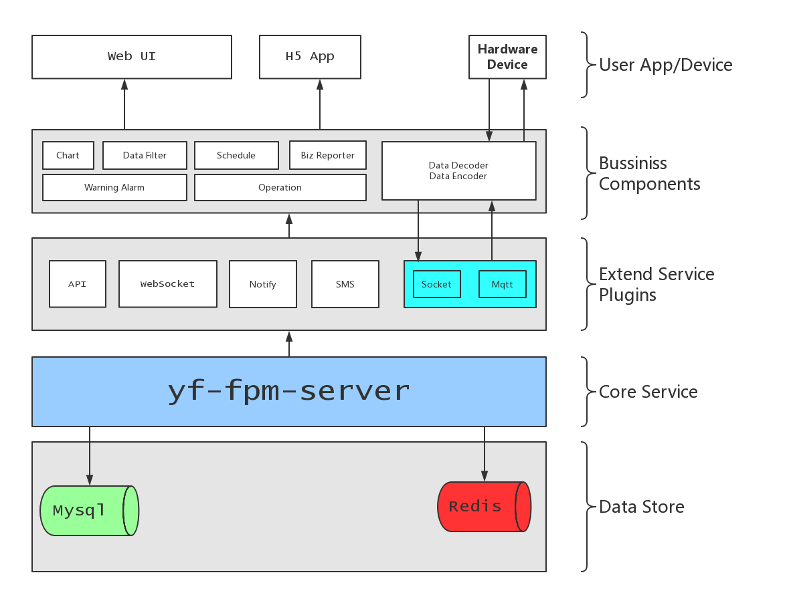

## 瑞威光电控制系统

#### Core Framework

YF-FPM-SERVER github -> [https://github.com/team4yf/yf-fpm-server](https://github.com/team4yf/yf-fpm-server)

#### System layer design

#### Copy config.json

- `$ cp config.simple.json config.json`
- change mysql config
  - db: ruiwei
  - user: root
  - pass: root

#### Run With Docker

- DEV Mode : `$ docker-compose -f docker-compose.dev.yml up --build -d`

- Open phpmyadmin [http://localhost:88](http://localhost:88)
  - user: **root**
  - pass: **root**
  
#### Run In Product Mode

- Use `PM2` Or `Pandora.js` To Run The Project
- **WARNING:** Can Only Use One Process To Run, Dont Run Multi Process Mode

#### Run In Dev Mode

- `$ npm i`
- `$ npm run dev`

#### Plugins

- fpm-plugin-ffmpeg (`INSTALLED`)
- fpm-plugin-mysql (`INSTALLED`)
- fpm-plugin-rbac-mysql (`INSTALLED`)
- fpm-plugin-user-service (`INSTALLED`)
- fpm-plugin-socketio (`INSTALLED`)
- fpm-plugin-mqtt-client (`INSTALLED`)

#### Database Scripts

In `sql` Directory

#### Messages

- Publish
  - [x] `#socket/connect`
  - [x] `#socket/close`
  - [x] `#socket/receive`
  - [x] `#nbiot/receive`

#### Data Transform Protocol
Use the same protocol when receive data from nbiot or socket . We define the datatype `Buffer` .

- Data Addr Defined

| Address | Name | Length(B) | R/W | Type | Remark |
|---------|------|-----------|-----|------|--------|
| 0001 | 光端机 | 1 | R/W | Boolean | 0:shutdown, 1:running |
| 0002 | 摄像机 | 1 | R/W | Boolean | 0:shutdown, 1:running |
| 0003 | 加热器 | 1 | R/W | Boolean | 0:shutdown, 1:running |
| 0004 | 风机   | 1 | R/W | Boolean | 0:shutdown, 1:running |
| 0005 | 补光灯 | 1 | R/W | Boolean | 0:shutdown, 1:running |
| 0006 | 12V输出光端机 | 1 | R/W | Boolean | 0:shutdown, 1:running |
| 0007 | 12V输出照明   | 1 | R/W | Boolean | 0:shutdown, 1:running |
| 0008 | 保留 | 1 | - | - | - |
| 0009 | 保留 | 1 | - | - | - |
| 000a | 保留 | 1 | - | - | - |
| 000b | 防雷器开关状态 | 1 | R | Boolean | 0:shutdown, 1:running |
| 000c | 柜门开关状态   | 1 | R | Boolean | 0:shutdown, 1:running |
| 000d | 温度   | 2 | R | Int16 | times 10 |
| 000f | 电压   | 2 | R | UInt16 | - |
| 0011 | 电流   | 2 | R | UInt16 | - |

> See more protocol's detail @[Protocol.md](./Protocol.md)

#### Cache Keys

> 定义的用于缓存的 Key

  - `#sn:${sn}/device/exists` 保存最新的设备 Exists 的信息

  - `#sn:${sn}/device` 保存最新的设备上传的信息; in `biz/device.js` line: 42

  - `#sn:${sn}/nb` 保存设备被定的 nb 号；

  - `#sn:${sn}/status` 记录设备的在线/离线状态； 缓存时间 10 min

  - `#sn:${sn}/handMessage/${fn}` 设备获取到的状态信息

  - `#sn:${sn}/trouble` 设备的故障状态信息

  - `#sn:${sn}/camera/${ip}/status` 

  - `#sn:${sn}/fixMode` 设备的维修状态； 缓存时间 10 min